# Database Schema

## Database Management

When you install the PostgreSQL database server, you create an initial [database
cluster](https://www.postgresql.org/docs/17/creating-cluster.html). A database
cluster can contain many databases, but NetSpider collects the output of all
of the scrapers into one database: `netspider`. We sometimes call `netspider`
the *main database* or the *main application database* to distinguish it from
template or system databases such as `postgres`.

> [!NOTE]
> NetSpider primarily accesses `netspider`, but it connects to `postgres`
> once to create the NetSpider database. NetSpider has to rely on `postgres`
> because [you must connect to a database to issue a `create database`
> command](https://www.postgresql.org/docs/17/manage-ag-createdb.html).

The remaining sections explain the schema of `netspider`, version `v01`.

## Common Data Types and Domains

NetSpider uses a few data types and domains throughout the schema:

- `sex` is an enum which can be `'Male'`, `'Female'`, or `'Other'`.
- `url` represents URLs, limited to 512 characters.
- `phone_number` represents phone numbers, limited to 128 characters.
- `email_address` represents email addresses, limited to 256 characters.
- `non_empty_text` represents non-empty strings of unlimited length.
- `non_empty_texts` represents arrays of non-null *and* non-empty strings.

The `url`, `phone_number`, and `email_address` domains are points where you can
add validation logic, but as of now, the database performs no validation except
checking that URLs, phone numbers, and email addresses are non-empty. In the
meantime, you can use these domains to make the schema more self-documenting.

`NOT NULL` *domain* constraints can be misleading according to [the PostgreSQL
documentation](https://www.postgresql.org/docs/17/sql-createdomain.html), so
none of the common domains have `NOT NULL` constraints. Unless you see `NOT
NULL` *column* constraints, you must assume columns can contain `NULL` values.

## Entity-Relationship (ER) Diagram

```mermaid
---
title: NetSpider
config: { er: { layoutDirection: LR } }
---

erDiagram
    raw_eros_posts {
        url link PK "NOT NULL"
        non_empty_text city_or_region PK "NOT NULL"
        varchar(4096) profile_header "CHECK (profile_header <> '')"
        varchar(4096) about_info "CHECK (about_info <> '')"
        varchar(4096) info_details "CHECK (info_details <> '')"
        varchar(4096) contact_details "CHECK (contact_details <> '')"
        non_empty_texts payment_methods "NOT NULL"
        non_empty_texts social_media_accounts "NOT NULL"
        non_empty_texts keywords "NOT NULL"
    }

    raw_escort_alligator_posts {
        url link PK "NOT NULL"
        non_empty_text city_or_region PK "NOT NULL"
        varchar(2048) specified_location "CHECK (specified_location <> '')"
        timestamp posted_on "without time zone"
        phone_number poster_phone_number
        integer poster_age "CHECK (poster_age > 0)"
        varchar(4096) description "CHECK (description <> '')"
        non_empty_texts payment_methods "NOT NULL"
        non_empty_texts social_media_accounts "NOT NULL"
        non_empty_texts keywords "NOT NULL"
    }

    raw_mega_personals_posts {
        url link PK "NOT NULL"
        non_empty_text city_or_region PK "NOT NULL"
        varchar(256) specified_city_or_region "CHECK (specified_city_or_region <> '')"
        varchar(512) specified_location "CHECK (specified_location <> '')"
        phone_number poster_phone_number
        varchar(128) poster_name "CHECK (poster_name <> '')"
        varchar(4096) description "CHECK (description <> '')"
        non_empty_texts payment_methods "NOT NULL"
        non_empty_texts social_media_accounts "NOT NULL"
        non_empty_texts keywords "NOT NULL"
    }

    raw_rub_ratings_posts {
        url link PK "NOT NULL"
        non_empty_text city_or_region PK "NOT NULL"
        varchar(256) specified_location "NOT NULL CHECK (specified_location <> '')"
        date last_activity "NOT NULL"
        phone_number poster_phone_number "NOT NULL"
        varchar(8) provider_id "NOT NULL CHECK (provider_id <> '')"
        varchar(1024) title "CHECK (title <> '')"
        varchar(4096) description "CHECK (description <> '')"
        non_empty_texts payment_methods "NOT NULL"
        non_empty_texts social_media_accounts "NOT NULL"
        non_empty_texts keywords "NOT NULL"
    }

    raw_skipthegames_posts {
        url link PK "NOT NULL"
        non_empty_text city_or_region PK "NOT NULL"
        varchar(1024) poster "CHECK (poster <> '')"
        varchar(4096) description "CHECK (description <> '')"
        varchar(2048) services "CHECK (services <> '')"
        non_empty_texts payment_methods "NOT NULL"
        non_empty_texts social_media_accounts "NOT NULL"
        non_empty_texts keywords "NOT NULL"
    }

    raw_yesbackpage_posts {
        url link PK "NOT NULL"
        non_empty_text city_or_region PK "NOT NULL"
        varchar(256) specified_location "CHECK (specified_location <> '')"
        timestamp posted_on "without time zone"
        timestamp expires_on "without time zone"
        phone_number poster_phone_number
        email_address poster_email_address
        varchar(128) poster_name "CHECK (poster_name <> '')"
        sex poster_sex
        email_address reply_to
        varchar(4096) description "CHECK (description <> '')"
        varchar(512) services "CHECK (services <> '')"
        non_empty_texts payment_methods "NOT NULL"
        non_empty_texts social_media_accounts "NOT NULL"
        non_empty_texts keywords "NOT NULL"
    }
```



## Schema Mapping

The ER model doesn't have any relationships, but there are multivalued/nullable
attributes. The "proper" strategy is to map each multivalued/nullable attribute
to a separate table, but the added complexity outweighs the benefits in a small
app. Instead, each entity maps directly to one table, and multivalued attributes
reduce to [arrays](https://www.postgresql.org/docs/17/arrays.html).

## Spreadsheet Compatibility

The current schema is a translation of the Excel spreadsheets, so the columns
of each table correspond almost exactly to the columns of the corresponding
"raw" spreadsheets. No attempt was made to track data related to, for instance,
repeated names, phone numbers, or email addresses.

Additionally, each table has a view whose columns match the columns of the
corresponding "clean" spreadsheets. Note that each clean spreadsheet/view
has the exact same set of columns. This is intentional: it means that you can
combine clean spreadsheets/views. You can try combining views using `union`:

```sql
(select * from clean_eros_view)
union
(select * from clean_escort_alligator_view);
```

## Text Length Limits

The schema uses a mix of `text` and `varchar(n)`. I (Daniel) wanted to save
space by limiting the amount of text in the database, so the columns that
contain raw strings directly from posts use `varchar(n)` (or domains based on
`varchar(n)`). The remaining columns only contain copies of small strings that
the developers or users have explicitly written down, such as city names.
